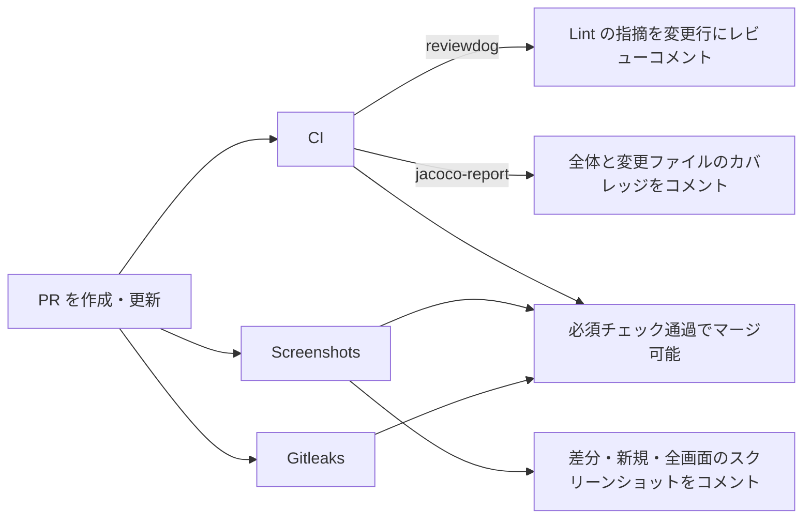

# CounterApp

Jetpack Compose で作ったシンプルなカウンターアプリです。
アプリ自体は小さく保ち、**テストと CI の仕組みを一通り揃えること**を主眼にしています。
PR を作ると静的解析・UNIT・VRT・シークレット検査が走り、Lint の指摘・カバレッジ・画面の差分が PR にコメントされます。

## アプリの機能

| カウンター | リセット確認 | 設定 | ダークテーマ |
| --- | --- | --- | --- |
|  |  |  |  |

画像は VRT が `main` へのマージごとに記録するベースラインをそのまま表示しています。

- **カウンター**: ＋／− で 0〜1000 の範囲を増減します。1 以上になるとリセットボタンが現れ、確認ダイアログを経て 0 に戻します。
- **テーマ**: システム設定・ライト・ダークから選べ、DataStore に保存します。Android 12 以上では Dynamic Color を使います。
- **言語**: English／日本語をアプリ単位で切り替えます（per-app language）。

## 使用しているライブラリ

バージョンは [gradle/libs.versions.toml](../gradle/libs.versions.toml) で一元管理し、Dependabot が毎週更新します。

| 分類 | ライブラリ・ツール |
| --- | --- |
| 言語・ビルド | Kotlin、Android Gradle Plugin、Gradle（Version Catalog）、KSP |
| UI | Jetpack Compose（BOM）、Material 3、Material Icons Extended、Activity Compose、Navigation Compose、Core SplashScreen、AppCompat（per-app language） |
| アーキテクチャ | AndroidX Lifecycle（ViewModel・StateFlow）、Hilt（Dagger）、Hilt Navigation Compose |
| データ | DataStore Preferences、kotlinx.serialization |
| デバッグ | LeakCanary |
| テスト | JUnit 4、Robolectric、Roborazzi、Compose UI Test、AndroidX Test（JUnit・Espresso） |
| 品質 | detekt、Android Lint、Kover |
| CI | GitHub Actions、reviewdog、jacoco-report、Gitleaks、Android Emulator Runner、Dependabot |

対応 OS は Android 7.0（API 24）以上、`targetSdk` は 37 です。

## テスト

役割ごとに 3 層に分け、実行タイミングを変えています。詳細は [TESTING.md](TESTING.md) を参照してください。

| 種類 | 検証すること | ツール | 実行タイミング |
| --- | --- | --- | --- |
| UNIT | `Counter` の増減と 0〜1000 の境界値、`CounterViewModel` の状態更新とリセット | JUnit 4 | pre-commit・PR・`main` への push |
| VRT | 実アプリを起動した 5 画面の見た目 | Robolectric + Roborazzi | PR・`main` への push |
| E2E | 増減・リセット・画面遷移・テーマ切り替えなど 9 シナリオの動作 | Compose UI Test（API 36 エミュレーター） | 毎週月曜 3:00 JST・手動 |

- VRT は見た目の差分検出に、E2E は動作の検証に役割を分けています。
- UNIT は `*UnitTest`、VRT は `*VRTest` というクラス名で区別し、CI はこの命名で対象を選びます。
- カバレッジは Kover で UNIT を計測し、Hilt・Compose コンパイラーの生成コードと Preview は除外しています。

## CI

すべて GitHub Actions で動きます。

| Workflow | トリガー | 内容 |
| --- | --- | --- |
| [CI](../.github/workflows/ci.yml) | PR・`main` への push・手動 | detekt と、Android Lint + UNIT + カバレッジ（Android SDK の準備とビルドを共有する 1 ジョブ） |
| [Screenshots](../.github/workflows/screenshots.yml) | PR・`main` への push | `main` ではベースラインを記録、PR ではベースラインと比較 |
| [Gitleaks](../.github/workflows/gitleaks.yml) | すべての push・PR | シークレットの混入を検査 |
| [Weekly E2E](../.github/workflows/e2e-tests.yml) | 毎週月曜 3:00 JST・手動 | エミュレーターで E2E を実行 |
| [Dependabot auto-merge](../.github/workflows/dependabot-auto-merge.yml) | Dependabot の PR | マイナー・パッチ更新を必須チェック通過後に自動マージ |

### PR で起きること



- スクリーンショットとカバレッジは PR ごとに 1 件のコメントを更新し続けるため、push のたびに増えません。
- マージの必須チェックは `gitleaks`・`detekt`・`lint-and-unit-tests`・`compare` です。
- Dependabot とフォークからの PR はトークンが読み取り専用のため、コメントを省略して結果を Artifact に残します。
- 各レポート（Lint・detekt・テスト結果・カバレッジ・スクリーンショット）は Artifact に 7 日間保存します。

### VRT の仕組み

画像はリポジトリ本体に含めず、使い捨てのブランチに置いています。

1. `main` への push で全画面を撮影し、`companion_main` ブランチにベースラインとして保存します。
2. PR ではベースラインと比較し、画像を `companion_pr-<番号>` ブランチに置いて PR コメントから参照します。
3. PR を閉じると `companion_pr-<番号>` ブランチを削除します。

## ローカル開発

JDK 21 と Android SDK（compileSdk 37.1）が必要です。
クローン後、コミット前に detekt・Android Lint・UNIT を自動で実行する pre-commit フックを有効にしてください。

```sh
cp .githooks/pre-commit .git/hooks/pre-commit
```

よく使うコマンドは次のとおりです。

```sh
./gradlew :app:installDebug                                  # 端末にインストール
./gradlew detekt :app:lintDebug                              # 静的解析
./gradlew :app:testDebugUnitTest --tests '*UnitTest'         # UNIT
./gradlew :app:testDebugUnitTest --tests '*UnitTest' :app:koverHtmlReportDebug  # カバレッジ（HTML）
./gradlew recordRoborazziDebug                               # VRT の画像を記録
./gradlew compareRoborazziDebug                              # VRT をベースラインと比較
./gradlew :app:connectedDebugAndroidTest                     # E2E（端末・エミュレーターが必要）
```

## ディレクトリ構成

```text
app/src/main/java/com/example/counterapp/
├── model/        # Counter・ThemeConfig
├── viewmodel/    # CounterViewModel・SettingsViewModel
├── view/         # 画面と UI コンポーネント
├── navigation/   # ボトムナビゲーション
├── repository/   # UserDataRepository
├── datastore/    # DataStore へのアクセス
├── di/           # Hilt モジュール
└── ui/theme/     # Material 3 テーマ
app/src/test/         # UNIT・VRT
app/src/androidTest/  # E2E
config/detekt/        # detekt の設定
.githooks/            # pre-commit フック
.github/workflows/    # CI
```
